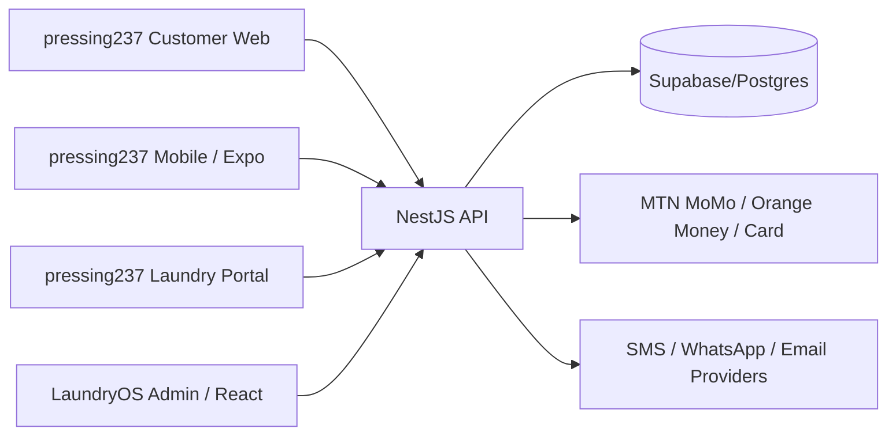

# 01 — JanLunMS Unified System Architecture

**Version:** 1.0.0  
**Status:** Active  
**Last Updated:** 2026-05-25  
**Related Modules:** All  
**Implementation Status:** In Progress  
**Dependencies:** 02_MONOREPO_STRUCTURE, 03_TECH_ARCHITECTURE  

## 1. Purpose

This document defines the unified architecture for **JanLunMS — Jan Laundry Management System**.

JanLunMS is one SaaS platform with multiple frontends:

| App | Brand | Purpose |
|---|---|---|
| `apps/customer-web` | pressing237 | Customer web ordering, tracking, payment |
| `apps/customer-mobile` | pressing237 Mobile | Customer mobile ordering, QR pickup |
| `apps/pressing-web` | pressing237 | Laundry/branch operational portal |
| `apps/admin-web` | LaundryOS | Platform staff/admin control plane |
| `apps/api` | JanLunMS API | Shared NestJS backend |

---

## 2. Product Structure

### JanLunMS

The overall SaaS platform.

### pressing237

Customer-facing brand for:
- service catalog browsing
- order placement (drop-off or pickup request)
- garment tracking by order/lot number
- online payment
- delivery status
- customer account/profile

### LaundryOS

Platform admin brand for:
- tenant management
- platform-wide analytics
- system configuration
- user management

---

## 3. Architectural Decision

The approved architecture is:

> **One SaaS platform with multiple frontends, one shared backend, one shared database platform with tenancy.**

This means:
- customer apps and pressing apps share the same backend
- all business rules live in the API
- frontend apps do not directly manipulate business tables
- tenancy is enforced in backend services and database design

---

## 4. High-Level System Diagram

---

## 5. Tenancy Model

JanLunMS is multi-tenant.

A tenant normally represents a laundry chain, brand, or independent operator.

Core tenant-bound records include:
- branches
- employees
- services and pricing
- customers
- orders
- lots
- garments
- delivery routes
- payments
- reports

Tenant identity may be resolved from:
- authenticated user context
- tenant domain/subdomain
- explicit internal admin context

---

## 6. Tenant Domain Strategy

### Staging

| Surface | Domain |
|---|---|
| Customer main site | `staging.pressing237.com` |
| Tenant customer site | `<alias>.staging.pressing237.com` |
| Pressing portal | `<alias>.staging.pressing237.com/staff` |
| Admin dashboard | `admin-staging.laundryos.com` |
| API | `api-staging.pressing237.com` |
| Supabase backend | `be-staging.pressing237.com` |
| Supabase Studio | `studio-staging.pressing237.com` |

### Production

| Surface | Domain |
|---|---|
| Customer main site | `pressing237.com` |
| Tenant customer site | `<alias>.pressing237.com` or custom domain |
| Pressing portal | `<alias>.pressing237.com/staff` |
| Admin dashboard | `admin.laundryos.com` |
| API | `api.pressing237.com` |
| Supabase backend | `be.pressing237.com` |
| Supabase Studio | `studio.pressing237.com` |

---

## 7. Data Flow

### Customer order flow

1. Customer browses services.
2. API returns service catalog with pricing.
3. Customer places order (drop-off or pickup request).
4. API creates order with `status = pending`.
5. If pickup requested, delivery module schedules route.
6. Garments received at branch → tagged → order status updates.
7. Garment processing begins (wash, dry, press, QC).
8. Order ready → notification sent to customer.
9. Customer pays online or at counter.
10. Order status → completed on pickup/delivery.

### Branch processing flow

1. Branch receives order (walk-in or pickup).
2. Staff creates lot and tags garments.
3. Garments flow through processing pipeline.
4. Quality check gate → pass or rewash.
5. Ready garments packaged and shelved.
6. Customer notified.
7. Pickup or delivery executed.
8. Order closed.

---

## 8. Non-Negotiable Architecture Rules

1. Frontends are API-driven.
2. Business logic lives in NestJS API.
3. Database schema is managed through migrations, not TypeORM synchronize.
4. Order lifecycle and garment states must remain strictly enforced.
5. Pricing must support per-kilo, per-item, and dynamic rules.
6. Payments must use a unified `transactions` model.
7. Provider-specific payment logic belongs behind adapters.
8. The pressing portal is custom React UI.
9. The platform dashboard (LaundryOS) is custom React UI.
10. Customer mobile remains React Native / Expo.
