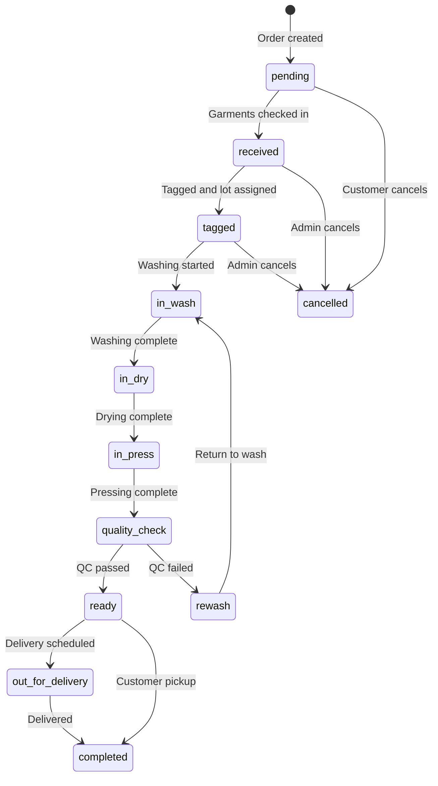

# 20 — NestJS Module and Table Blueprint

**Version:** 1.0.0  
**Status:** Active  
**Last Updated:** 2026-05-25  
**Related Modules:** All backend modules  
**Implementation Status:** In Progress  
**Dependencies:** 03_TECH_ARCHITECTURE  

## 1. Purpose

This document defines backend modules and their table ownership for JanLunMS.

---

## 2. Module Ownership

| Module | Owns |
|--------|------|
| `reference` | countries, cities, garment_types, fabric_types, care_labels, service_categories |
| `tenants` | tenants, tenant_domains, tenant_settings |
| `auth` | auth/session/token integration only |
| `users` | user_profiles, user_roles, permissions |
| `customers` | customer_profiles, customer_addresses, customer_loyalty |
| `branches` | branches, branch_hours, branch_equipment |
| `services` | service_types, pricing_rules, promotions, service_packages |
| `orders` | orders, order_items, order_status_history, order_payments |
| `lots` | lots, lot_garments, lot_tracking |
| `inventory` | inventory_items, inventory_transactions, suppliers, stock_alerts |
| `delivery` | delivery_routes, delivery_stops, vehicles, driver_assignments |
| `employees` | employee_profiles, employee_documents, shifts, attendance |
| `payroll` | payroll_periods, payslips, work_entries, deductions, bonuses |
| `payments` | transactions, payment_methods, refunds, wallet_balances |
| `notifications` | notifications, notification_templates, notification_adapters |
| `reports` | read-only aggregates |
| `qr_codes` | qr_tags, qr_scans, qr_events |
| `settings` | system_config, reference_data, custom_fields |
| `compliance` | audit_logs, tax_records, data_retention |

---

## 3. Critical Rules

### Auth/User boundary

`auth` must not own profile CRUD.
`users` owns `user_profiles`.

### Order/Garment boundary

`orders` owns order headers and status.
`lots` owns batch groupings.
Individual garment tracking belongs to `orders` via `order_items`.

### Payment model

Use unified `transactions`.
Do not create provider-specific primary transaction tables.

### Reports

Read-only. No operational writes.

### Pricing rules

`pricing_rules` belong to `services` module.
`promotions` (coupon codes, discounts) belong to `payments` module.
These are separate concerns — do not conflate them.

---

## 4. Reference Tables

### `garment_types`

| Column | Type | Notes |
|--------|------|-------|
| id | uuid | PK |
| tenant_id | uuid | FK tenants |
| name | varchar | e.g. 'Shirt', 'Dress', 'Suit' |
| category | varchar | male / female / boy / girl / baby / unisex |
| default_service_id | uuid | FK service_types |
| care_instructions | text | |
| handling_notes | text | |
| is_active | boolean | |
| created_at | timestamptz | |
| updated_at | timestamptz | |

### `fabric_types`

| Column | Type | Notes |
|--------|------|-------|
| id | uuid | PK |
| tenant_id | uuid | FK tenants |
| name | varchar | e.g. 'Cotton', 'Silk', 'Wool' |
| care_level | varchar | standard / delicate / dry_clean_only |
| washing_temp_max | int | Celsius |
| drying_method | varchar | tumble / line / flat / dry_clean |
| is_active | boolean | |
| created_at | timestamptz | |

### `care_labels`

| Column | Type | Notes |
|--------|------|-------|
| id | uuid | PK |
| tenant_id | uuid | FK tenants |
| symbol_code | varchar | e.g. 'W30', 'D', 'IRON2' |
| description | varchar | |
| icon_url | varchar | |
| created_at | timestamptz | |

---

## 5. Core Order Tables

### `orders`

| Column | Type | Notes |
|--------|------|-------|
| id | uuid | PK |
| tenant_id | uuid | FK tenants |
| branch_id | uuid | FK branches |
| customer_id | uuid | FK customers |
| order_number | varchar | Unique per tenant, human-readable |
| order_type | enum | walk_in / pickup_request / delivery_request |
| status | enum | See state machine below |
| priority | enum | standard / express / rush |
| service_type_id | uuid | FK service_types |
| pricing_type | enum | per_kilo / per_item / flat_rate |
| total_items | int | |
| total_weight_kg | decimal | |
| subtotal | decimal | |
| discount_amount | decimal | |
| tax_amount | decimal | |
| total_amount | decimal | |
| amount_paid | decimal | |
| amount_due | decimal | |
| payment_status | enum | pending / partial / paid / refunded |
| pickup_scheduled_at | timestamptz | |
| delivery_scheduled_at | timestamptz | |
| ready_by_estimated | timestamptz | |
| completed_at | timestamptz | |
| notes | text | |
| created_by | uuid | FK users |
| created_at | timestamptz | |
| updated_at | timestamptz | |

### Order status values

| Status | Meaning |
|--------|---------|
| `pending` | Order created, garments not yet received |
| `received` | Garments checked in at branch |
| `tagged` | Garments tagged and lot assigned |
| `in_wash` | Washing/initial cleaning in progress |
| `in_dry` | Drying phase |
| `in_press` | Pressing/ironing/finishing |
| `quality_check` | Quality control gate |
| `ready` | Processing complete, awaiting pickup/delivery |
| `out_for_delivery` | On delivery route |
| `completed` | Picked up or delivered, order closed |
| `cancelled` | Order cancelled |

### `order_items`

| Column | Type | Notes |
|--------|------|-------|
| id | uuid | PK |
| order_id | uuid | FK orders |
| lot_id | uuid | FK lots |
| garment_type_id | uuid | FK garment_types |
| fabric_type_id | uuid | FK fabric_types |
| color | varchar | |
| size | varchar | |
| brand | varchar | |
| observed_issue | text | stains, tears, missing buttons |
| customer_declared_value | decimal | For insurance |
| service_type_id | uuid | FK service_types |
| unit_price | decimal | |
| quantity | int | Usually 1 |
| line_total | decimal | |
| status | enum | Same as order status |
| qr_tag_id | uuid | FK qr_codes |
| before_photo_url | varchar | |
| after_photo_url | varchar | |
| notes | text | |
| created_at | timestamptz | |
| updated_at | timestamptz | |

### `order_status_history`

| Column | Type | Notes |
|--------|------|-------|
| id | uuid | PK |
| order_id | uuid | FK orders |
| status | enum | |
| previous_status | enum | |
| changed_by | uuid | FK users |
| changed_at | timestamptz | |
| notes | text | Reason for change |

---

## 6. Lot Management Tables

### `lots`

| Column | Type | Notes |
|--------|------|-------|
| id | uuid | PK |
| tenant_id | uuid | FK tenants |
| branch_id | uuid | FK branches |
| lot_number | varchar | Human-readable batch number |
| order_id | uuid | FK orders |
| customer_id | uuid | FK customers |
| status | enum | open / processing / ready / closed |
| rack_location | varchar | Physical shelf location |
| total_garments | int | |
| created_at | timestamptz | |
| updated_at | timestamptz | |

### `lot_garments`

| Column | Type | Notes |
|--------|------|-------|
| id | uuid | PK |
| lot_id | uuid | FK lots |
| order_item_id | uuid | FK order_items |
| garment_position | int | Sequence in lot |
| added_at | timestamptz | |

---

## 7. Service and Pricing Tables

### `service_types`

| Column | Type | Notes |
|--------|------|-------|
| id | uuid | PK |
| tenant_id | uuid | FK tenants |
| name | varchar | e.g. 'Wash & Fold', 'Dry Clean', 'Wash & Iron' |
| code | varchar | Short code |
| description | text | |
| pricing_type | enum | per_kilo / per_item / flat_rate |
| base_price | decimal | Default price |
| min_order_amount | decimal | |
| turnaround_hours | int | Standard completion time |
| express_surcharge_pct | int | Extra % for express |
| rush_surcharge_pct | int | Extra % for rush |
| is_active | boolean | |
| created_at | timestamptz | |

### `pricing_rules`

| Column | Type | Notes |
|--------|------|-------|
| id | uuid | PK |
| tenant_id | uuid | FK tenants |
| service_type_id | uuid | FK service_types |
| garment_type_id | uuid | FK garment_types (nullable) |
| fabric_type_id | uuid | FK fabric_types (nullable) |
| price_per_kg | decimal | For per-kilo pricing |
| price_per_item | decimal | For per-item pricing |
| min_price | decimal | |
| max_price | decimal | |
| effective_from | date | |
| effective_until | date | Nullable |
| is_active | boolean | |
| created_at | timestamptz | |

### `promotions`

| Column | Type | Notes |
|--------|------|-------|
| id | uuid | PK |
| tenant_id | uuid | FK tenants |
| code | varchar | Coupon code |
| name | varchar | |
| description | text | |
| discount_type | enum | percentage / fixed_amount |
| discount_value | decimal | |
| min_order_amount | decimal | |
| max_discount_amount | decimal | |
| usage_limit | int | Total allowed uses |
| usage_count | int | Current uses |
| valid_from | timestamptz | |
| valid_until | timestamptz | |
| is_active | boolean | |
| created_at | timestamptz | |

---

## 8. Delivery Logistics Tables

### `vehicles`

| Column | Type | Notes |
|--------|------|-------|
| id | uuid | PK |
| tenant_id | uuid | FK tenants |
| branch_id | uuid | FK branches |
| registration_number | varchar | |
| vehicle_type | varchar | van / truck / motorcycle |
| capacity_kg | decimal | |
| status | enum | active / maintenance / retired |
| insurance_expires | date | |
| last_maintenance_at | timestamptz | |
| created_at | timestamptz | |

### `delivery_routes`

| Column | Type | Notes |
|--------|------|-------|
| id | uuid | PK |
| tenant_id | uuid | FK tenants |
| branch_id | uuid | FK branches |
| route_name | varchar | |
| route_code | varchar | |
| area_coverage | geometry | PostGIS polygon |
| estimated_duration_minutes | int | |
| is_active | boolean | |
| created_at | timestamptz | |

### `delivery_stops`

| Column | Type | Notes |
|--------|------|-------|
| id | uuid | PK |
| route_id | uuid | FK delivery_routes |
| stop_sequence | int | |
| order_id | uuid | FK orders |
| stop_type | enum | pickup / delivery |
| address | text | |
| latitude | decimal | |
| longitude | decimal | |
| scheduled_time | timestamptz | |
| actual_time | timestamptz | |
| status | enum | pending / completed / failed / skipped |
| notes | text | |
| created_at | timestamptz | |

### `driver_assignments`

| Column | Type | Notes |
|--------|------|-------|
| id | uuid | PK |
| tenant_id | uuid | FK tenants |
| driver_id | uuid | FK employees |
| vehicle_id | uuid | FK vehicles |
| route_id | uuid | FK delivery_routes |
| assignment_date | date | |
| shift_start | timestamptz | |
| shift_end | timestamptz | |
| status | enum | scheduled / active / completed / cancelled |
| created_at | timestamptz | |

---

## 9. Inventory Tables

### `inventory_items`

| Column | Type | Notes |
|--------|------|-------|
| id | uuid | PK |
| tenant_id | uuid | FK tenants |
| branch_id | uuid | FK branches |
| sku | varchar | Stock keeping unit |
| name | varchar | |
| category | varchar | detergent / softener / packaging / equipment / supplies |
| unit_of_measure | varchar | kg / liter / piece / box |
| current_quantity | decimal | |
| min_stock_level | decimal | Reorder threshold |
| max_stock_level | decimal | |
| reorder_point | decimal | |
| unit_cost | decimal | |
| supplier_id | uuid | FK suppliers |
| location | varchar | Storage location |
| is_active | boolean | |
| created_at | timestamptz | |

### `inventory_transactions`

| Column | Type | Notes |
|--------|------|-------|
| id | uuid | PK |
| inventory_item_id | uuid | FK inventory_items |
| transaction_type | enum | purchase / consumption / adjustment / transfer |
| quantity | decimal | Positive or negative |
| unit_cost | decimal | |
| total_cost | decimal | |
| reference_type | varchar | order / manual / purchase_order |
| reference_id | uuid | |
| notes | text | |
| created_by | uuid | FK users |
| created_at | timestamptz | |

### `suppliers`

| Column | Type | Notes |
|--------|------|-------|
| id | uuid | PK |
| tenant_id | uuid | FK tenants |
| name | varchar | |
| contact_person | varchar | |
| phone | varchar | |
| email | varchar | |
| address | text | |
| payment_terms | varchar | |
| is_active | boolean | |
| created_at | timestamptz | |

---

## 10. Employee and Payroll Tables

### `employee_profiles`

| Column | Type | Notes |
|--------|------|-------|
| id | uuid | PK |
| tenant_id | uuid | FK tenants |
| branch_id | uuid | FK branches |
| user_id | uuid | FK users (nullable) |
| employee_number | varchar | |
| first_name | varchar | |
| last_name | varchar | |
| email | varchar | |
| phone | varchar | |
| role | enum | See below |
| status | enum | invited / active / inactive / suspended |
| hire_date | date | |
| termination_date | date | |
| base_salary | decimal | Monthly or hourly |
| salary_type | enum | monthly / hourly |
| department | varchar | |
| created_at | timestamptz | |
| updated_at | timestamptz | |

### Employee role values

| Role | Meaning |
|------|---------|
| `manager` | Branch or operations manager |
| `counter_staff` | Front desk/order intake |
| `washer` | Washing machine operator |
| `presser` | Ironing/pressing operator |
| `qc_inspector` | Quality control |
| `driver` | Pickup/delivery driver |
| `admin` | System administrator |

### `shifts`

| Column | Type | Notes |
|--------|------|-------|
| id | uuid | PK |
| tenant_id | uuid | FK tenants |
| branch_id | uuid | FK branches |
| employee_id | uuid | FK employee_profiles |
| shift_date | date | |
| start_time | timestamptz | |
| end_time | timestamptz | |
| break_minutes | int | |
| status | enum | scheduled / checked_in / checked_out / missed |
| notes | text | |
| created_at | timestamptz | |

### `payroll_periods`

| Column | Type | Notes |
|--------|------|-------|
| id | uuid | PK |
| tenant_id | uuid | FK tenants |
| period_start | date | |
| period_end | date | |
| status | enum | draft / processing / approved / paid / closed |
| total_gross | decimal | |
| total_deductions | decimal | |
| total_net | decimal | |
| processed_by | uuid | FK users |
| processed_at | timestamptz | |
| created_at | timestamptz | |

### `payslips`

| Column | Type | Notes |
|--------|------|-------|
| id | uuid | PK |
| payroll_period_id | uuid | FK payroll_periods |
| employee_id | uuid | FK employee_profiles |
| gross_salary | decimal | |
| total_deductions | decimal | |
| net_salary | decimal | |
| payment_status | enum | pending / paid |
| payment_date | date | |
| payment_method | enum | bank_transfer / cash / mobile_money |
| created_at | timestamptz | |

### `work_entries`

| Column | Type | Notes |
|--------|------|-------|
| id | uuid | PK |
| employee_id | uuid | FK employee_profiles |
| shift_id | uuid | FK shifts |
| entry_type | enum | regular / overtime / holiday |
| hours_worked | decimal | |
| hourly_rate | decimal | |
| amount | decimal | |
| notes | text | |
| created_at | timestamptz | |

### `deductions`

| Column | Type | Notes |
|--------|------|-------|
| id | uuid | PK |
| tenant_id | uuid | FK tenants |
| name | varchar | e.g. 'Tax', 'Pension', 'Health Insurance' |
| deduction_type | enum | percentage / fixed_amount |
| value | decimal | |
| is_active | boolean | |
| created_at | timestamptz | |

---

## 11. QR Code Tracking Tables

### `qr_tags`

| Column | Type | Notes |
|--------|------|-------|
| id | uuid | PK |
| tenant_id | uuid | FK tenants |
| tag_code | varchar | Unique QR code string |
| tag_type | enum | order / garment / lot |
| reference_id | uuid | Polymorphic reference |
| reference_type | varchar | 'order' / 'order_item' / 'lot' |
| generation_method | enum | system / manual |
| expires_at | timestamptz | Nullable |
| is_active | boolean | |
| created_at | timestamptz | |

### `qr_scans`

| Column | Type | Notes |
|--------|------|-------|
| id | uuid | PK |
| qr_tag_id | uuid | FK qr_tags |
| scanned_by | uuid | FK users |
| scanned_at | timestamptz | |
| scan_location | varchar | Branch or GPS |
| scan_action | enum | check_in / stage_transition / pickup / delivery / qc_pass / qc_fail |
| latitude | decimal | |
| longitude | decimal | |
| notes | text | |
| created_at | timestamptz | |

---

## 12. Payment Tables

### `transactions`

| Column | Type | Notes |
|--------|------|-------|
| id | uuid | PK |
| tenant_id | uuid | FK tenants |
| order_id | uuid | FK orders |
| customer_id | uuid | FK customers |
| transaction_code | varchar | Unique reference |
| amount | decimal | |
| currency | varchar | XAF / USD / EUR |
| payment_provider | enum | mtn / orange / card / cash / wallet |
| payment_method | enum | mobile_money / credit_card / debit_card / cash / bank_transfer |
| status | enum | pending / initiated / processing / success / failed / expired / cancelled |
| transaction_type | enum | payment / refund / top_up |
| provider_reference | varchar | External transaction ID |
| processed_at | timestamptz | |
| metadata | jsonb | Provider-specific data |
| created_at | timestamptz | |

---

## 13. Notification Tables

### `notifications`

| Column | Type | Notes |
|--------|------|-------|
| id | uuid | PK |
| tenant_id | uuid | FK tenants |
| recipient_type | enum | customer / employee / admin |
| recipient_id | uuid | |
| channel | enum | sms / whatsapp / email / push |
| template_id | uuid | FK notification_templates |
| subject | varchar | |
| content | text | |
| status | enum | pending / sent / failed / delivered |
| sent_at | timestamptz | |
| delivered_at | timestamptz | |
| error_message | text | |
| created_at | timestamptz | |

### `notification_templates`

| Column | Type | Notes |
|--------|------|-------|
| id | uuid | PK |
| tenant_id | uuid | FK tenants |
| name | varchar | e.g. 'order_ready', 'pickup_reminder' |
| event_trigger | varchar | |
| channel | enum | sms / whatsapp / email / push |
| subject_template | varchar | |
| body_template | text | With {{variables}} |
| language | varchar | en / fr |
| is_active | boolean | |
| created_at | timestamptz | |

---

## 14. Customer Tables

### `customer_profiles`

| Column | Type | Notes |
|--------|------|-------|
| id | uuid | PK |
| tenant_id | uuid | FK tenants |
| user_id | uuid | FK users (nullable) |
| first_name | varchar | |
| last_name | varchar | |
| email | varchar | |
| phone | varchar | |
| phone_verified | boolean | |
| date_of_birth | date | |
| gender | varchar | |
| loyalty_tier | enum | bronze / silver / gold / platinum |
| loyalty_points | int | |
| total_orders | int | |
| total_spent | decimal | |
| preferred_branch_id | uuid | FK branches |
| notes | text | |
| created_at | timestamptz | |
| updated_at | timestamptz | |

### `customer_addresses`

| Column | Type | Notes |
|--------|------|-------|
| id | uuid | PK |
| customer_id | uuid | FK customer_profiles |
| address_type | enum | home / work / other |
| label | varchar | e.g. 'Home' |
| address_line_1 | varchar | |
| address_line_2 | varchar | |
| city | varchar | |
| state | varchar | |
| postal_code | varchar | |
| country | varchar | |
| latitude | decimal | |
| longitude | decimal | |
| is_default | boolean | |
| created_at | timestamptz | |

---

## 15. Tenant and Branch Tables

### `tenants`

| Column | Type | Notes |
|--------|------|-------|
| id | uuid | PK |
| name | varchar | |
| slug | varchar | Unique subdomain |
| logo_url | varchar | |
| primary_color | varchar | Hex color |
| secondary_color | varchar | Hex color |
| status | enum | active / suspended / cancelled |
| subscription_plan | varchar | |
| max_branches | int | |
| max_users | int | |
| created_at | timestamptz | |
| updated_at | timestamptz | |

### `branches`

| Column | Type | Notes |
|--------|------|-------|
| id | uuid | PK |
| tenant_id | uuid | FK tenants |
| name | varchar | |
| code | varchar | |
| address | text | |
| city | varchar | |
| phone | varchar | |
| email | varchar | |
| manager_id | uuid | FK employee_profiles |
| opening_hours | jsonb | Mon-Sun schedule |
| latitude | decimal | |
| longitude | decimal | |
| is_active | boolean | |
| created_at | timestamptz | |

---

## 16. Compliance Tables

### `audit_logs`

| Column | Type | Notes |
|--------|------|-------|
| id | uuid | PK |
| tenant_id | uuid | FK tenants |
| user_id | uuid | FK users |
| action | varchar | e.g. 'order.created', 'payment.processed' |
| entity_type | varchar | |
| entity_id | uuid | |
| old_values | jsonb | |
| new_values | jsonb | |
| ip_address | varchar | |
| user_agent | varchar | |
| created_at | timestamptz | |

### `tax_records`

| Column | Type | Notes |
|--------|------|-------|
| id | uuid | PK |
| tenant_id | uuid | FK tenants |
| record_type | enum | sales_tax / vat / income_tax |
| period_start | date | |
| period_end | date | |
| taxable_amount | decimal | |
| tax_rate | decimal | |
| tax_amount | decimal | |
| status | enum | draft / filed / paid |
| created_at | timestamptz | |

---

## 17. Garment Lifecycle State Machine

### Exception Paths

| From State | Exception | To State | Trigger |
|------------|-----------|----------|---------|
| `quality_check` | Rewash required | `in_wash` | QC fail |
| `quality_check` | Damage found | `damaged` | QC damage |
| `damaged` | Customer notified | `compensated` | Resolution |
| `ready` | Customer no-show | `on_hold` | Hold period expired |
| `out_for_delivery` | Delivery failed | `ready` | Retry or pickup |

---

## 18. Index Summary

| Table | Primary Purpose |
|-------|----------------|
| `orders` | Order header and status |
| `order_items` | Individual garment lines |
| `order_status_history` | Audit trail |
| `lots` | Batch grouping |
| `lot_garments` | Lot contents |
| `service_types` | Service catalog |
| `pricing_rules` | Dynamic pricing |
| `promotions` | Discounts |
| `garment_types` | Reference: garment types |
| `fabric_types` | Reference: fabric types |
| `care_labels` | Reference: care symbols |
| `customers` | Customer profiles |
| `customer_addresses` | Delivery addresses |
| `branches` | Physical locations |
| `employees` | Staff records |
| `shifts` | Work schedules |
| `payroll_periods` | Pay cycles |
| `payslips` | Salary statements |
| `work_entries` | Time tracking |
| `deductions` | Payroll deductions |
| `delivery_routes` | Route definitions |
| `delivery_stops` | Scheduled stops |
| `vehicles` | Fleet registry |
| `driver_assignments` | Driver scheduling |
| `inventory_items` | Stock items |
| `inventory_transactions` | Stock movements |
| `suppliers` | Vendor directory |
| `transactions` | Payment records |
| `qr_tags` | QR code registry |
| `qr_scans` | Scan events |
| `notifications` | Message log |
| `notification_templates` | Template definitions |
| `audit_logs` | Compliance audit |
| `tax_records` | Tax filing data |
