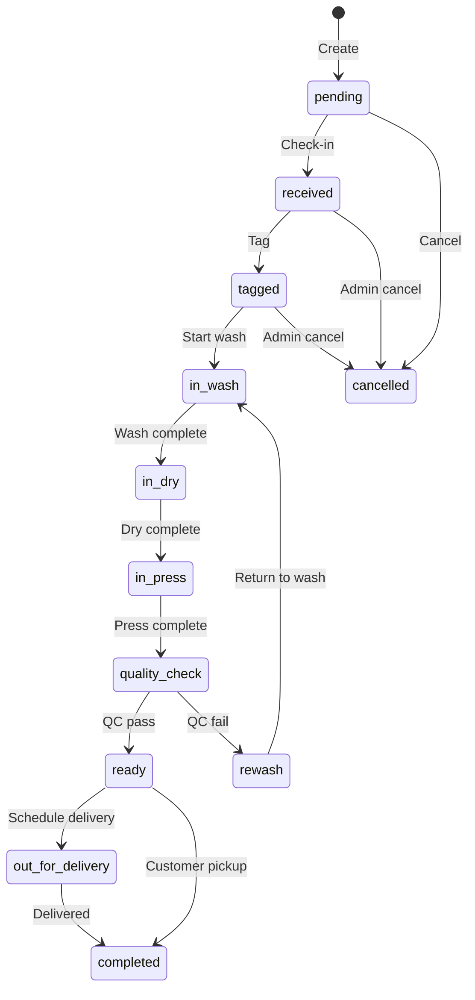

# 29 — Order and QR Spec

**Version:** 1.0.0  
**Status:** Active  
**Last Updated:** 2026-05-25  
**Related Modules:** orders, qr-codes  
**Implementation Status:** In Progress  
**Dependencies:** 20_NESTJS_MODULE_AND_TABLE_BLUEPRINT, 31_GARMENT_LIFECYCLE_SRD  

## 1. Purpose

Define order lifecycle state machine, QR code generation, and scanning workflows.

---

## 2. Order Lifecycle State Machine

### States

| State | Code | Description |
|-------|------|-------------|
| `pending` | P | Order created, not yet received |
| `received` | R | Garments checked in at branch |
| `tagged` | T | Tagged and lot assigned |
| `in_wash` | W | Washing in progress |
| `in_dry` | D | Drying in progress |
| `in_press` | P | Pressing/finishing |
| `quality_check` | Q | Quality control gate |
| `ready` | Y | Processing complete |
| `out_for_delivery` | O | On delivery route |
| `completed` | C | Picked up or delivered |
| `cancelled` | X | Order cancelled |
| `rewash` | RW | Return to wash (QC fail) |
| `damaged` | DM | Damage found |
| `compensated` | CP | Damage resolved |
| `on_hold` | H | Holding for customer |

### Transitions



### Transition Rules

| From | To | Allowed By | Condition |
|------|-----|-----------|-----------|
| `pending` | `received` | Counter staff | Garments physically received |
| `received` | `tagged` | Counter staff | All garments tagged |
| `tagged` | `in_wash` | Washer | Lot assigned to machine |
| `in_wash` | `in_dry` | Washer | Wash cycle complete |
| `in_dry` | `in_press` | Dryer | Dry cycle complete |
| `in_press` | `quality_check` | Presser | Pressing complete |
| `quality_check` | `ready` | QC Inspector | Pass inspection |
| `quality_check` | `rewash` | QC Inspector | Fail inspection |
| `rewash` | `in_wash` | Washer | Restart wash |
| `quality_check` | `damaged` | QC Inspector | Damage discovered |
| `damaged` | `compensated` | Manager | Resolution reached |
| `ready` | `out_for_delivery` | Counter staff | Delivery scheduled |
| `ready` | `completed` | Counter staff | Customer pickup |
| `out_for_delivery` | `completed` | Driver | Delivery confirmed |
| `ready` | `on_hold` | System | Hold period > 7 days |
| `pending` | `cancelled` | Customer | Before check-in |
| `received` | `cancelled` | Manager | Before processing |

---

## 3. QR Code System

### QR Types

| Type | Prefix | Example | Purpose |
|------|--------|---------|---------|
| Order | `ORD-` | `ORD-123456` | Order header |
| Garment | `GAR-` | `GAR-789012` | Individual garment |
| Lot | `LOT-` | `LOT-345678` | Batch grouping |
| Pickup | `PCK-` | `PCK-901234` | Pickup verification |
| Delivery | `DLV-` | `DLV-567890` | Delivery confirmation |

### QR Generation

```typescript
interface QRTag {
  id: uuid;
  tenant_id: uuid;
  tag_code: string;      // e.g. "ORD-123456"
  tag_type: 'order' | 'garment' | 'lot' | 'pickup' | 'delivery';
  reference_id: uuid;     // Order/Item/Lot ID
  reference_type: string;
  expires_at?: Date;      // For pickup/delivery codes
  is_active: boolean;
}
```

### QR Payload Format

```
JANLUNMS:{version}:{type}:{tenant_id}:{reference_id}:{checksum}
```

Example:
```
JANLUNMS:1:ORD:550e8400-e29b-41d4-a716-446655440000:abc123:7f3a9b
```

---

## 4. Scan Workflows

### 4.1 Check-in Scan

**Actor:** Counter staff
**Scan:** Customer shows order QR (from mobile app)
**Action:**
1. Decode QR
2. Verify order exists and status = `pending`
3. Transition to `received`
4. Print garment tags
5. Create lot

### 4.2 Stage Transition Scan

**Actor:** Washer/Presser/QC
**Scan:** Garment QR tag
**Action:**
1. Decode QR
2. Find order item
3. Display current status
4. Show allowed next statuses
5. Staff selects new status
6. Record transition
7. Update order status (aggregate of items)

### 4.3 Pickup Scan

**Actor:** Counter staff
**Scan:** Customer shows pickup QR
**Action:**
1. Decode QR
2. Verify order status = `ready`
3. Check payment status = `paid` (or cash payment)
4. Transition to `completed`
5. Mark garments as picked up
6. Send confirmation

### 4.4 Delivery Scan

**Actor:** Driver
**Scan:** Delivery QR on package or customer app
**Action:**
1. Decode QR
2. Verify order status = `out_for_delivery`
3. Record delivery location (GPS)
4. Customer signature or photo
5. Transition to `completed`
6. Send confirmation

---

## 5. API Endpoints

### QR Generation

```
POST /api/v1/qr/generate
Body: { type, reference_id, expires_at? }
Response: { tag_code, qr_image_url }

GET /api/v1/qr/:tag_code
Response: QR tag details
```

### QR Scan

```
POST /api/v1/qr/scan
Body: { tag_code, scan_action, location?, notes? }
Response: { success, order?, item?, allowed_actions? }
```

### Order Status Update

```
PUT /api/v1/orders/:id/status
Body: { status, notes? }
Response: Updated order
```

---

## 6. Security

- QR codes are tenant-scoped
- Expired pickup/delivery codes rejected
- Rate limiting on scan endpoints
- Audit log of all scans
- Duplicate scan detection
